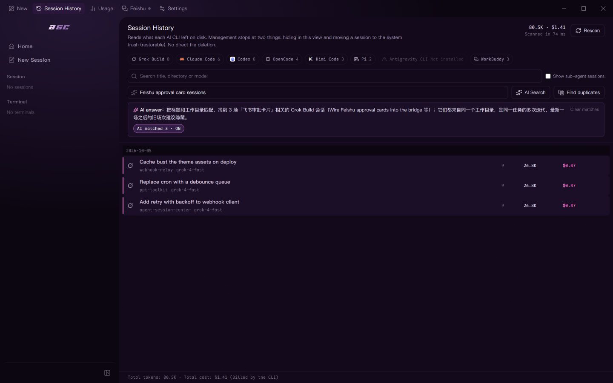
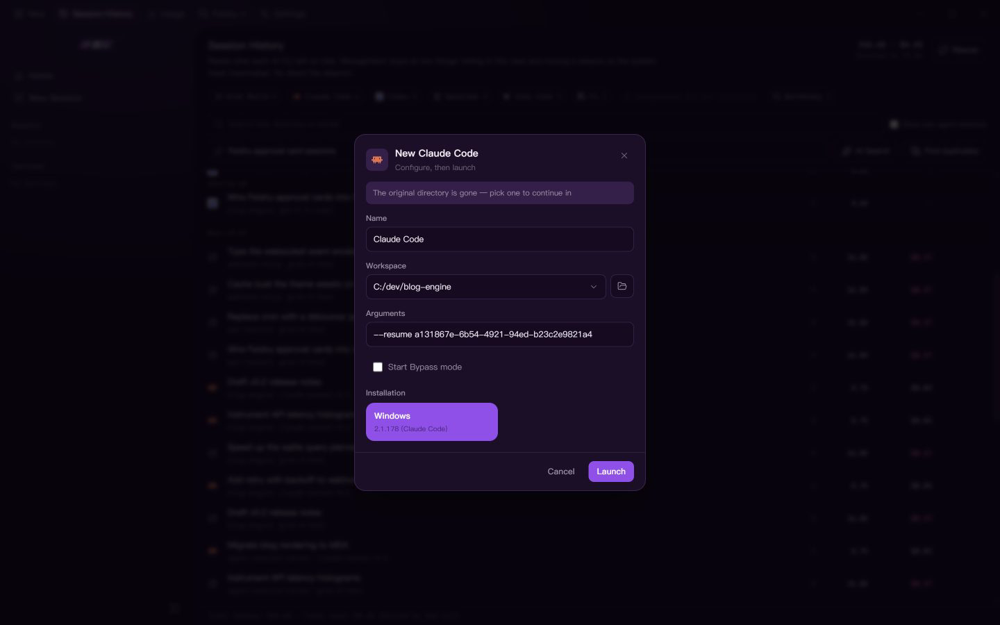
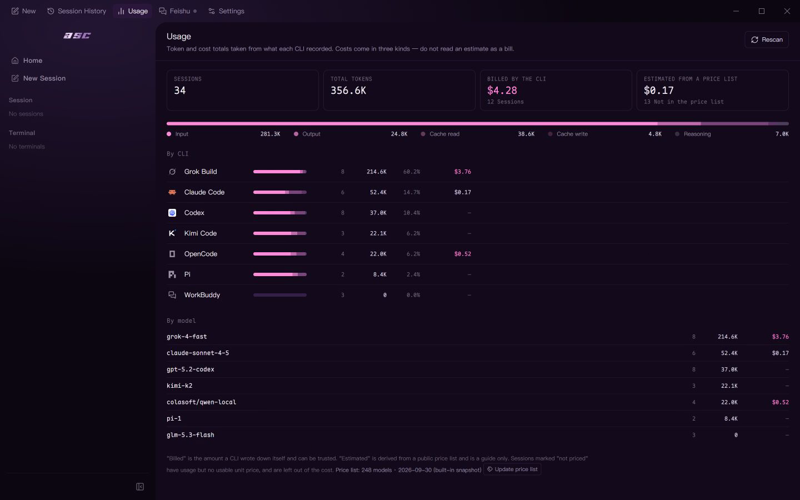
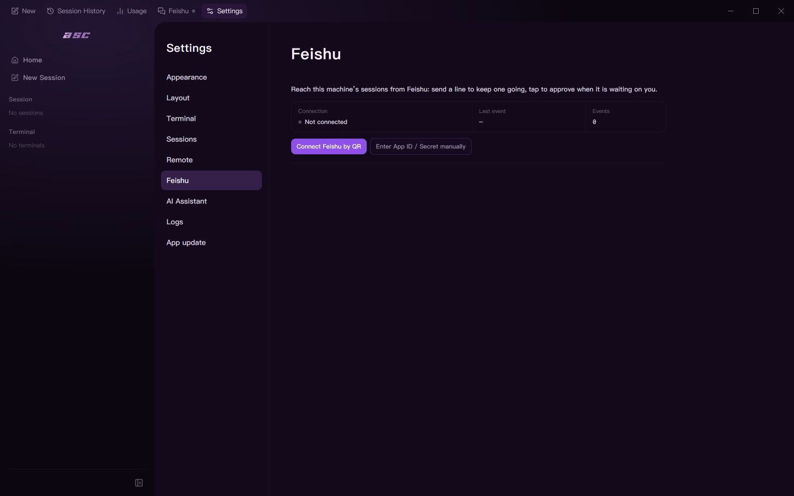
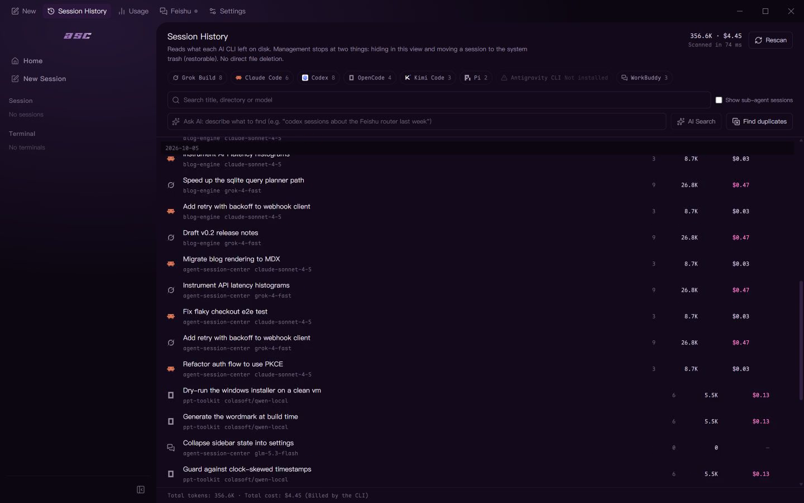
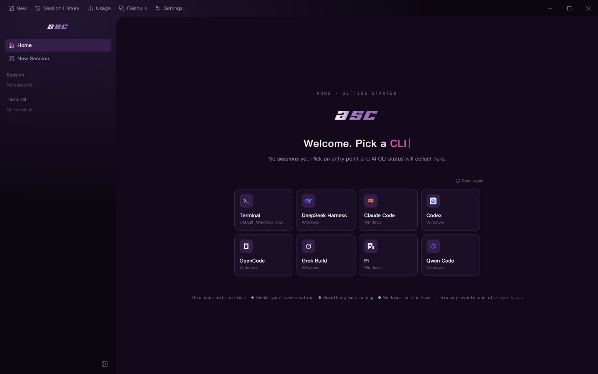

<p align="right">
  <a href="./README.zh-CN.md">简体中文</a>
</p>

<div align="center">
  <picture>
    <source media="(prefers-color-scheme: dark)" srcset="./assets/readme/asc-wordmark-dark.png">
    
  </picture>

  <h3>One center for 8 coding agents</h3>
  <p>Find, resume, fork and hand off every session — and approve from your phone.</p>

  <p>
    <a href="./LICENSE"></a>
    <a href="https://github.com/fatedawn/agent-session-center/releases"></a>
    <a href="https://github.com/fatedawn/agent-session-center/releases"></a>
    <a href="https://github.com/fatedawn/agent-session-center/stargazers"></a>
    <a href="https://github.com/fatedawn/agent-session-center/commits/main"></a>
  </p>

  
  <p><sub>Session history → AI search → one-click resume → usage and cost → Feishu approval. <a href="./docs/demo/asc-demo-en.mp4">Watch the full 46-second video</a>.</sub></p>
</div>

**Agent Session Center (ASC)** is a desktop session center for **8 AI coding agents** — Claude Code, Codex CLI, OpenCode, Grok Build, Kimi Code, Pi, Antigravity and WorkBuddy. Browse and search every session a CLI has written to disk, resume it in one click, and when an agent stalls on an approval, a Feishu push brings it to your phone — one tap to approve.

The CLI keeps its native TUI and does all the work. ASC adds the layer that is usually missing around it: live status, attention cues, a floating monitor, quick launch, and a read-only workspace viewer. The Python session tools and Feishu helper are the same product, in [`hub/`](./hub).

## Upstream

The early prototype was derived from [UniRound-Tec/hrack](https://github.com/UniRound-Tec/hrack) (Apache-2.0), a project with no affiliation to this one. Agent Session Center is an independently maintained hard fork — its own identity, roadmap, and release channel; no code, branch, or release is tracked from upstream. Every file in this repository is maintained here. Attribution, the change summary, and the measured extent of the inheritance live in [NOTICE](./NOTICE).

No upstream build is signed. The upstream project publishes unsigned builds only, and no upstream binary is ever signed with this project's certificate or redistributed under this project's name.

## The problem

Different coding agents are useful for different jobs, so one terminal quickly becomes several. The friction is not starting them — it is keeping track of them:

- You switch away, come back later, and discover that an agent has been waiting on a permission prompt the whole time. Codex and Gemini CLI users have both asked for better attention signals ([Codex](https://github.com/openai/codex/issues/10081), [Gemini CLI](https://github.com/google-gemini/gemini-cli/issues/14696)).
- Once several agents run in parallel, you start hunting through tabs for the one that needs you. The same problem shows up in [multi-agent workflow discussions](https://news.ycombinator.com/item?id=47268777) and tools such as [tmux-claude-session-manager](https://github.com/craftzdog/tmux-claude-session-manager).
- A notification alone is not enough if it never fires ([Codex #8929](https://github.com/openai/codex/issues/8929)), cannot tell that the agent is waiting for an answer ([Codex #13478](https://github.com/openai/codex/issues/13478)), or misses an interactive shell waiting for input ([Gemini CLI #19527](https://github.com/google-gemini/gemini-cli/issues/19527)).

Agent Session Center keeps those sessions together, tells you which one needs attention, and takes you back to the right place. The original CLI still does all the work; Agent Session Center simply means you do not have to stare at it.

## How it works

On first launch, Agent Session Center discovers compatible CLIs on the host and in WSL. The result is cached for fast startup and can be rescanned manually. Each supported harness has an adapter that turns its official Hooks, SSE stream, extension API, or runtime events into one shared vocabulary — and then derives status from those events rather than from the terminal.

<div align="center">
  
</div>

Three properties fall out of that shape, and all three matter more than the feature list:

- **The terminal is never parsed.** A CLI's TUI is full of box drawing, spinners and colour. Nothing about status is read from those bytes; the observer subscribes to structured events instead.
- **Order comes from `seq`, not from wall-clock time.** Hooks replay, RPC connections drop and reconnect, and a transcript can be tailed twice. Every event carries a monotonic per-session sequence number and a native id, both of which are used to drop duplicates and to keep the true order.
- **An observer can die without killing your session.** If it does, the PTY keeps running. ASC degrades the *display* — `observerHealth` goes `stale`, `statusConfidence` drops to `low` — instead of breaking the CLI you are working in.

## What it is allowed to tell you

Status is a projection of facts, not a guess. There are exactly six states, and only one of them asks for you.

<div align="center">
  
</div>

Coral `#FF6B4A` is the one colour in the product that glows, and it means one thing: **this session is blocked on your confirmation.** Everything else is a flat dot. The rule is deliberate — if several things compete for attention, none of them gets it.

## The attention loop

This is the whole idea in one picture. Six agents, one coffee break.

<div align="center">
  
</div>

While you are away the other five keep working and never interrupt you. The one that blocks on an approval reaches your phone as a card; approving it from there sends the decision back into the same PTY, and the turn continues — nothing was restarted, and nothing was lost.

## What each agent can report

Harnesses are not equally observable, and pretending otherwise would be the easiest lie in a README. Each adapter declares the capabilities it can actually prove for the session in front of you, and the UI shows the level it is at rather than a brand claim.

<div align="center">
  
</div>

Read the right-hand columns first — that is where the sources separate. **OpenCode** goes furthest overall and is the only one that reports message summaries; **Pi** is the only one that reports tokens *and* context rather than a single number. Read the left-hand columns to see what every harness gets: a thinking phase and tool lifecycle, everywhere.

Live observation and session history are two separate layers. Reading what a CLI wrote to disk does not require its runtime to expose anything:

| Source | Live status | Session history |
| --- | --- | --- |
| DeepSeek Harness, Claude Code, Codex CLI, OpenCode, Pi, Kimi Code, Grok Build | Yes | Yes |
| Antigravity, WorkBuddy | Not yet | Yes |

Session history is available for all nine sources — the eight coding agents plus DeepSeek Harness. Browse, search, token usage, and resume where the source exposes a resumable session. The two layers are separate on purpose — a source can be readable without exposing its runtime event stream.

### Integration detail

| Harness | Integration | Status available to ASC | Runtimes |
| --- | --- | --- | --- |
| DeepSeek Harness | Official Web surface + runtime bridge | Followed session and lifecycle | Host, WSL |
| Claude Code | Official Hooks | Thinking, tools, approvals, completion | Host, WSL |
| Codex CLI | Stable Hooks | Turns, tools, approvals, compaction | Host, WSL |
| OpenCode | Server + SSE | Sessions, thinking, tools, questions, permissions | Host, WSL |
| Pi | Extension API | Thinking, responses, tools, turns | Host, WSL |
| Kimi Code | Official Hooks | Turns, thinking, tools, approvals | Host, WSL |
| Grok Build | Official Hooks | Turns, thinking, tools, approvals | Host, WSL |

Agent Session Center can also discover and launch Devin CLI, Cline, Qwen Code, Amp, Aider, Goose, Kiro CLI, GitHub Copilot CLI, and other registered CLIs. Launch-only integrations do not expose the same level of status detail yet.

Field depth varies by source. Title, time, turn count, and token usage are available for all of them. Cost is shown when it is known — either recorded by the agent itself or priced from the model catalogue, and left out rather than guessed when the model is not in that catalogue. Per-turn recaps and git-drift detection are currently backed by Grok Build's `summary.json`; the other agents' session files do not record that data, so there is nothing to read. That is a limit of the upstream formats, not a queued feature.

## Highlights

### Ask in one sentence

Describe what you are looking for — "the session where the Feishu approval card was wired up" — and ASC returns the matching sessions along with its answer. The assistant endpoint is configured by you and called directly from the desktop app.

<div align="center">
  
</div>

### Resume in place, and admit when you cannot

Where the agent exposes a resumable session, ASC offers one-click resume in the original working directory. When that directory is gone, it says so and asks you to pick another one instead of failing silently.

<div align="center">
  
</div>

### Tokens and cost, per agent

Usage is aggregated from each CLI's own records. Grok Build records its own bill; cost for the others is priced from the model catalogue when the model is known, and left out rather than guessed when it is not.

<div align="center">
  
</div>

### Approve from your phone

Connect Feishu once with a QR scan. From then on, a session that stalls on a permission prompt sends you a card you can act on without going back to the desk.

<div align="center">
  
</div>

### Every session, one table

Session history reads what each CLI itself wrote to disk — across every source. Browse, semantic-search, hide, or send to the recycle bin; the underlying files are never touched.

<div align="center">
  
</div>

### The parts without screenshots

- **Floating window.** A always-on-top status surface, itself a built-in renderer. Custom renderers use the same public interface and can be built with HTML, CSS, JavaScript, animation libraries, or canvas; settings ship a short built-in skill you can hand to your coding agent to create and install one.
- **Read-only workspace viewer.** A file tree beside the terminal, with highlighted source and Markdown preview, while the agent keeps its native TUI.
- **Themes, fonts, and layout.** Independent application and terminal themes, terminal font and sizing, navigation modes, and the floating renderer — all on one settings page.
- **Fast launch across runtimes.** Start a shell or a detected CLI from the Home screen or the quick-launch panel, on host installations and compatible WSL distributions. DeepSeek Harness appears only after a local or WSL install is found.

<div align="center">
  
</div>

## Install

> **Status: early 1.x.** Stable for daily use, but configuration keys and the `hub/` layout may still change within the 1.x line. Pin a version if you need that guarantee.

Download the latest build from [GitHub Releases](https://github.com/fatedawn/agent-session-center/releases/latest):

- **Windows x64** — `AgentSessionCenter-Setup-x.y.z.exe`, a guided NSIS installer, so you can choose the installation directory.
- **Linux x64** — `AgentSessionCenter-x.y.z-linux-x64.AppImage` (portable: download, `chmod +x`, run) or `AgentSessionCenter-x.y.z-linux-x64.deb` (installs with `apt`).
- **macOS Apple Silicon** — `AgentSessionCenter-x.y.z-macos-arm64.dmg`, or the `.zip` if you want to drop the app in place yourself.
- **macOS Intel** — `AgentSessionCenter-x.y.z-macos-x64.dmg`, or the `.zip`.

Every release publishes a SHA-256 checksum beside each installable file; see [Verifying a download](#verifying-a-download) for what that does and does not prove.

**No downloadable build is code-signed.** Windows shows a SmartScreen prompt on first launch, macOS blocks the app until you allow it, and Linux packages need no signature at all. None of that is an oversight — see the [code signing policy](#code-signing-policy).

### Windows: where it installs

The installer defaults to **per-user**: without touching anything it installs to `%LOCALAPPDATA%\Programs\Agent Session Center`, and you will not find it under `C:\Program Files`. To install into Program Files instead, pick **Install for all users** on the installer's first page (that choice asks for administrator approval).

The Start-menu and desktop shortcuts are named **ASC (Agent Session Center)** — typing `asc` into the Start menu finds it.

### macOS: getting past Gatekeeper

macOS builds are **unsigned and not notarized**, so the first launch is blocked. How you allow it depends on your version:

On **macOS 15 (Sequoia) and later** — including macOS 26 — the old *right-click → Open* shortcut no longer bypasses Gatekeeper. Try to open the app once, then go to **System Settings → Privacy & Security**, scroll to **Security**, find the notice about the blocked app, and choose **Open Anyway**. You will be asked to authenticate. That button only appears *after* a blocked attempt.

On **macOS 10.14 through 14**, *right-click → Open* still works and is the faster path.

If you would rather not click through the UI, remove the quarantine flag from the bundle you installed:

```bash
xattr -d com.apple.quarantine "/Applications/Agent Session Center.app"
```

That touches only the bundle you name — it is not a system-wide change and it does not alter any security setting. Do it after checking the published SHA-256, not before.

Removing the prompt entirely requires notarization, which requires a paid Apple Developer Program membership. This project does not have one, so macOS releases stay unsigned by design rather than by omission.

### If the window never appears

If the app flashes and exits on launch, the GPU process most likely cannot start. This happens on some machines with the virtual displays that remote-control software installs, inside VMs, or with broken GPU drivers: Chromium retries the GPU process a few times, gives up, and exits before any window is created.

Two things to try:

1. **Start it once with the GPU sandbox disabled:**

   ```powershell
   & "$env:LOCALAPPDATA\Programs\Agent Session Center\Agent Session Center.exe" --no-sandbox
   ```

   (Adjust the path if you installed elsewhere.) If the app opens this way, a virtual-display driver is the likely trigger.

2. **Read the diagnostic log** at `%APPDATA%\Agent Session Center\logs\asc-diagnostic.jsonl`. GPU-process failures are recorded there with their reason and exit code; the same log is surfaced in Settings.

Since v1.0.2 the app detects this condition itself and shows a dialog with these instructions instead of exiting silently.

### First run

1. Start Agent Session Center and let the initial CLI scan finish.
2. Pick a terminal or coding CLI.
3. Choose its runtime and workspace.
4. Start the session. Agent Session Center keeps the native TUI in the main pane and publishes its status around it.

If Codex asks you to review Hooks, open `/hooks`, inspect the Agent Session Center definition, and trust it. For Kimi Code, Agent Session Center maintains a versioned managed block in the effective user `config.toml`; content outside that block is preserved. Grok Build installs a dedicated `asc-observer.json` under `~/.grok/hooks/` (or `$GROK_HOME/hooks` / the matching WSL home), which Grok treats as a trusted user hook.

## Development

The desktop app lives in the repository root (`src/` + `electron/`).

```bash
git clone https://github.com/fatedawn/agent-session-center.git
cd agent-session-center
npm install
npm run dev
```

Useful checks:

```bash
npm run typecheck
npm run build
```

End-to-end tests are not part of the GitHub CI pipeline — they need a real DeepSeek Harness host and a desktop session. Run them locally with `npm run e2e:only` if you touch an observer or the terminal layer.

Windows, macOS, and Linux release packages must be built on their matching operating systems through `npm run release:win`, `npm run release:mac`, and `npm run release:linux`. Windows and Linux packages are also built by CI on GitHub-hosted runners; the macOS matrix builds and verifies arm64 and x64 on native runners of each architecture. DSH e2e tests install an isolated, gitignored `dsh-runtime` fixture via `npm run ensure:dsh`; it is not packaged into releases. See [docs/RELEASING.md](./docs/RELEASING.md) for the full list of release gates.

## Contributing

Bug reports, reproducible edge cases, and focused pull requests are welcome. Observer changes should include a fixture or runtime test that proves event ordering and fallback behavior. Please open an [issue](https://github.com/fatedawn/agent-session-center/issues) before starting a large feature.

See [CONTRIBUTING.md](./CONTRIBUTING.md) for the local setup, branch naming, and commit conventions.

## Code signing policy

**No release is code-signed today — on any platform.** The Windows installer, the macOS disk images, and the Linux packages are all built and published unsigned, so the operating system will interrupt the first launch and you have to allow it through. What makes a download checkable here is not a signature but the published SHA-256 together with the fact that the build ran in this repository's CI — see [Verifying a download](#verifying-a-download).

Should a signature be added later, it will mean exactly one thing: **this file is an automated build produced from this public repository by the release workflow in it.** It is not a claim about the publisher's identity and it is not a warranty.

### Planned signing

Agent Session Center intends to sign its Windows installer through [SignPath Foundation](https://signpath.org), whose certificate is issued to SignPath Foundation itself rather than to this project. **That application has not been submitted**, so no release carries a signature today. The conditions that would apply once it is in place — team roles, what may be signed, and how each release is approved — are recorded in [`docs/SIGNPATH-APPLICATION.md`](./docs/SIGNPATH-APPLICATION.md).

Signing the macOS builds would require notarization through the paid Apple Developer Program. There is no free path to a notarized macOS build, so macOS releases stay unsigned and the [Gatekeeper steps](#macos-getting-past-gatekeeper) above are the supported way to run them.

### Team roles

Agent Session Center is maintained by one person, so the three roles a signing policy requires would be held by the same maintainer. If more maintainers join, this table is updated and signing approval becomes a two-person step — the committer of a release cannot also approve that release's signing request.

| Role | Responsibility | Members |
| --- | --- | --- |
| Authors (committers) | May modify source in this repository without additional review | [`@fatedawn`](https://github.com/fatedawn) |
| Reviewers | Reviews every change proposed by someone without commit access | [`@fatedawn`](https://github.com/fatedawn) |
| Approvers | Would approve each individual code signing request | [`@fatedawn`](https://github.com/fatedawn) |

Every team member has multi-factor authentication enabled on GitHub. There is no SignPath account yet, so that half of the requirement is not in effect — it takes effect if and when signing is adopted.

### What a signature would cover

- Only the Windows NSIS installer built from this repository by the release workflow, and only after a human approves that specific request. A workflow run could not sign itself.
- macOS and Linux packages are built and published by their own scripts and stay outside any signing policy.
- The `latest.yml`, `latest-linux.yml` and `latest-mac.yml` update metadata and the `.blockmap` files belong to the same release but are not signed; they are covered by the published SHA-256.

Nothing from an upstream project is ever signed. The one upstream this codebase derives from — [UniRound-Tec/hrack](https://github.com/UniRound-Tec/hrack) — publishes unsigned builds and is unaffiliated with this project; no binary originating there is signed with our certificate or redistributed under our name. Electron, `node-pty`, and the other bundled libraries keep their own signatures or stay unsigned inside our installer.

### Release build process

1. The maintainer commits the version bump and the matching `## [x.y.z]` section in `CHANGELOG.md`, then pushes a `vX.Y.Z` tag.
2. A release workflow runs on GitHub-hosted runners — [Windows](./.github/workflows/release-windows.yml) and [Linux](./.github/workflows/release-linux.yml) on x64, [macOS](./.github/workflows/release-mac.yml) as a two-architecture matrix so each build is verified on a native runner. Each runs `npm ci`, `npm run build`, and then the repository's own packaging script, which runs every release gate (packaged-resource assertions, update-metadata assertions, a launch test of the packaged app, and an icon check).
3. Each workflow uploads its unsigned packages as build artifacts. Nothing is published by this step.
4. The maintainer reviews the artifacts and their SHA-256 values, then runs the [publish workflow](./.github/workflows/publish-release.yml), which re-verifies every artifact against its checksum and attaches them to the Release.

Everything that can influence what gets published — the build scripts, the CI workflows, the packaging configuration, and the release gates — lives in this repository and is reviewed with the same care as the application code itself.

### Verifying a download

```powershell
# Windows — the hash must match the one published in the release notes.
Get-FileHash .\AgentSessionCenter-Setup-x.y.z.exe -Algorithm SHA256
```

```bash
# Linux and macOS
shasum -a 256 AgentSessionCenter-x.y.z-macos-arm64.dmg
```

A matching hash proves the download is intact and is the file the maintainer published. It does not by itself prove who built it — that is the one thing a code signature would add, and it is not available yet:

```powershell
# Once signing is in place, this will additionally report Status: Valid.
Get-AuthenticodeSignature .\AgentSessionCenter-Setup-x.y.z.exe | Format-List Status, SignerCertificate
```

### Privacy

Agent Session Center does not transfer any information to other networked systems unless specifically requested by the user. The one automatic request — an update check against this repository's own releases — can be switched off with `ASC_DISABLE_UPDATES=1`. Every outbound request the application is capable of making, what triggers it, what it carries, and how to turn it off is listed in [PRIVACY.md](./PRIVACY.md).

## Friends

- [LINUX DO](https://linux.do/)

## License

Agent Session Center is licensed under the [Apache License 2.0](./LICENSE).

---

<div align="center">
  <sub>Free your mind. Get back to vibe coding.</sub>
</div>
