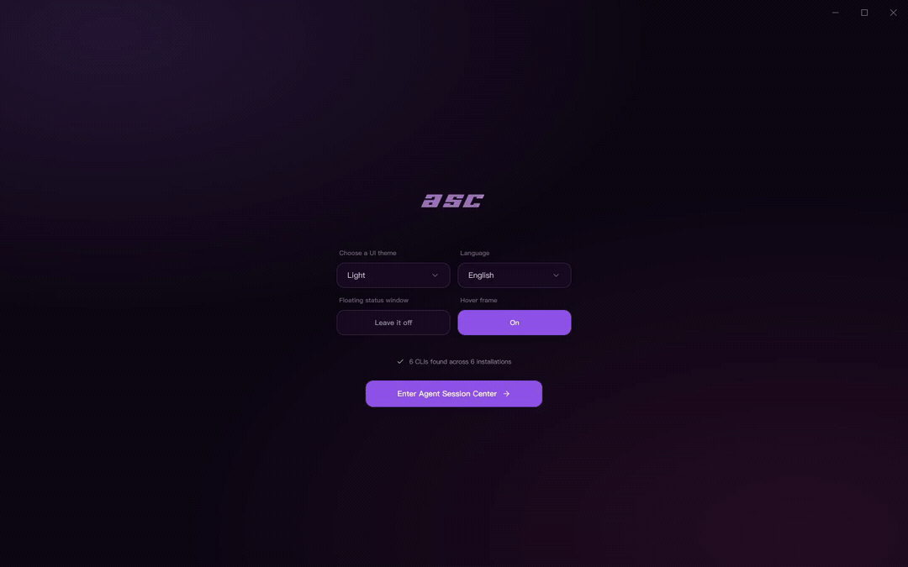
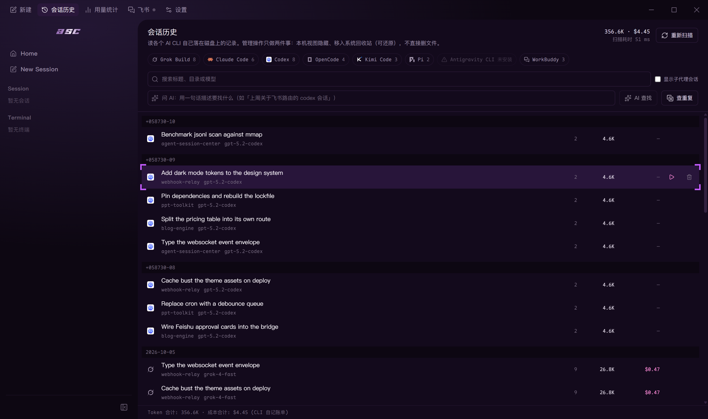
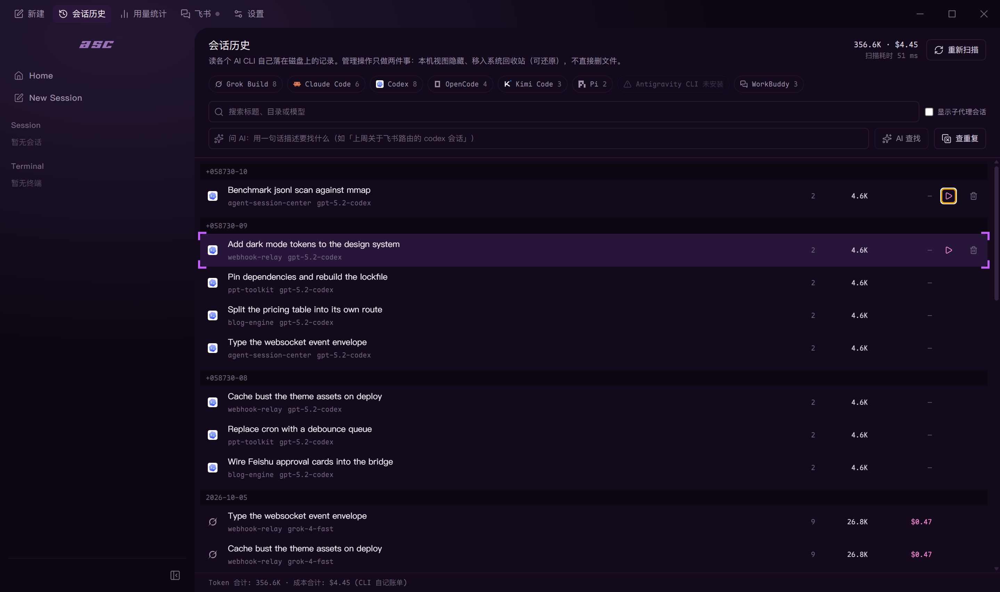
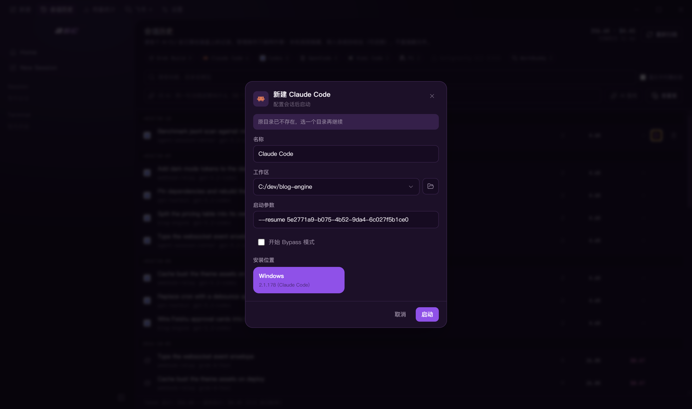
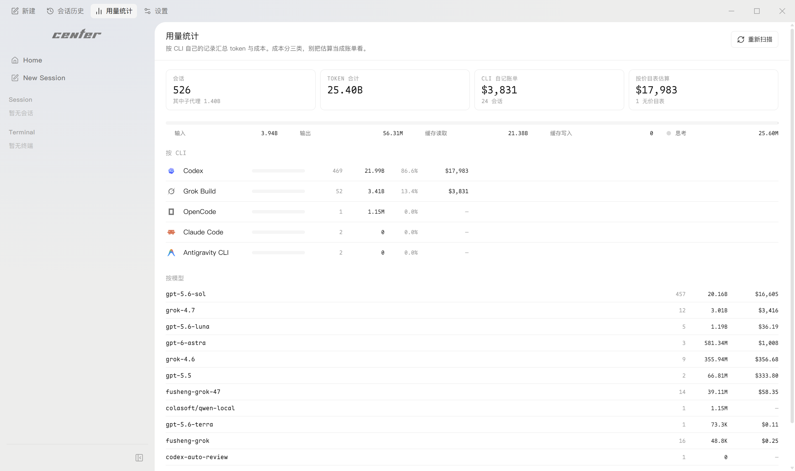

<p align="right">
  <a href="./README.zh-CN.md">简体中文</a>
</p>

<div align="center">
  <picture>
    <source media="(prefers-color-scheme: dark)" srcset="./assets/readme/asc-wordmark-dark.png">
    
  </picture>

  <h3>One center for 8 coding agents</h3>
  <p>Find, resume, fork and hand off every session — and approve from your phone.</p>

  <p>
    <a href="./LICENSE"></a>
    <a href="https://github.com/fatedawn/agent-session-center/releases"></a>
    <a href="https://github.com/fatedawn/agent-session-center/releases"></a>
    <a href="https://github.com/fatedawn/agent-session-center/stargazers"></a>
    <a href="https://github.com/fatedawn/agent-session-center/commits/main"></a>
  </p>

  
  <p><sub>Session history → AI search → one-click resume → usage and cost → Feishu approval. <a href="./docs/demo/asc-demo-en.mp4">Watch the full 46-second video</a>.</sub></p>
</div>

**Agent Session Center (ASC)** is a desktop session center for **8 AI coding agents** — Claude Code, Codex CLI, OpenCode, Grok Build, Kimi Code, Pi, Antigravity and WorkBuddy. Browse and search every session a CLI has written to disk, resume it in one click, and when an agent stalls on an approval, a Feishu push brings it to your phone — one tap to approve.

The CLI keeps its native TUI and does all the work. ASC adds the layer that is usually missing around it: live status, attention cues, a floating monitor, quick launch, and a read-only workspace viewer. The Python session tools and Feishu helper are the same product, in [`hub/`](./hub).

## Upstream

The early prototype was derived from [UniRound-Tec/hrack](https://github.com/UniRound-Tec/hrack) (Apache-2.0), a project with no affiliation to this one. Agent Session Center is an independently maintained hard fork — its own identity, roadmap, and release channel; no code, branch, or release is tracked from upstream. Every file in this repository is maintained here. Attribution, the change summary, and the measured extent of the inheritance live in [NOTICE](./NOTICE).

No upstream build is signed. The upstream project publishes unsigned builds only, and no upstream binary is ever signed with this project's certificate or redistributed under this project's name.

## The problem

Different coding agents are useful for different jobs, so one terminal quickly becomes several. The friction is not starting them — it is keeping track of them:

- You switch away, come back later, and discover that an agent has been waiting on a permission prompt the whole time. Codex and Gemini CLI users have both asked for better attention signals ([Codex](https://github.com/openai/codex/issues/10081), [Gemini CLI](https://github.com/google-gemini/gemini-cli/issues/14696)).
- Once several agents run in parallel, you start hunting through tabs for the one that needs you. The same problem shows up in [multi-agent workflow discussions](https://news.ycombinator.com/item?id=47268777) and tools such as [tmux-claude-session-manager](https://github.com/craftzdog/tmux-claude-session-manager).
- A notification alone is not enough if it never fires ([Codex #8929](https://github.com/openai/codex/issues/8929)), cannot tell that the agent is waiting for an answer ([Codex #13478](https://github.com/openai/codex/issues/13478)), or misses an interactive shell waiting for input ([Gemini CLI #19527](https://github.com/google-gemini/gemini-cli/issues/19527)).

Agent Session Center keeps those sessions together, tells you which one needs attention, and takes you back to the right place. The original CLI still does all the work; Agent Session Center simply means you do not have to stare at it.

## How it works

On first launch, Agent Session Center discovers compatible CLIs on the host and in WSL. The result is cached for fast startup and can be rescanned manually. Each supported harness has an adapter that turns its official Hooks, SSE stream, extension API, or runtime events into a small shared vocabulary:

```text
thinking · tool call · needs you · completed · error
```

Those facts drive the sidebar, the floating window, and the history view without touching terminal bytes:

```text
CLI ── PTY ──────────────────────────────> native TUI
 └── Hooks / SSE / extension events ──> adapter ──> status and alerts

workspace ── read-only access ──────────> file tree and viewer
```

If an observer fails, the PTY keeps running. Agent Session Center degrades the status display instead of breaking the CLI session.

## Highlights

### Every session, one table

Session history reads what each CLI itself wrote to disk — across all eight sources. Browse, semantic-search in one sentence, hide, or send to the recycle bin; the underlying files are never touched.

<div align="center">
  
</div>

### Resume in place

Where the agent exposes a resumable session, ASC offers one-click resume in the original working directory — with an honest split of what is resumable and why the rest is not.

<div align="center">
  
  
</div>

### Ask AI to find a session

Describe what you are looking for in one sentence — "the session where the Feishu approval card was wired up" — and ASC returns the matching sessions along with its answer. The assistant endpoint is configured by you and called directly from the desktop app.

### Tokens and cost, per agent

Usage is aggregated from each CLI's own records. Grok Build records its own bill; cost for the others is priced from the model catalogue when the model is known, and left out rather than guessed when it is not.

<div align="center">
  
</div>

### Make the floating window yours

The default floating monitor is itself a built-in renderer. Custom renderers use the same public interface and can be built with HTML, CSS, JavaScript, animation libraries, or canvas. Settings include a short built-in skill that you can copy and give to your coding agent to create and install a renderer.

### Read the workspace without leaving the session

Open a read-only file tree beside the terminal, inspect highlighted source, and preview Markdown while the agent keeps its native TUI.

### Themes, fonts, and layout

Choose independent application and terminal themes, adjust terminal fonts and sizing, switch navigation modes, and configure the floating renderer from one settings page.

### Fast launch across runtimes

Start a shell or detected coding CLI from the Home screen or quick-launch panel. Agent Session Center supports host installations and compatible WSL distributions. DeepSeek Harness appears only after a local or WSL install is found.

## Supported harnesses

| Harness | Integration | Status available to Agent Session Center | Runtimes |
| --- | --- | --- | --- |
| DeepSeek Harness | Official Web surface + runtime bridge | Followed session and lifecycle | Host, WSL |
| Claude Code | Official Hooks | Thinking, tools, approvals, completion | Host, WSL |
| Codex CLI | Stable Hooks | Turns, tools, approvals, compaction | Host, WSL |
| OpenCode | Server + SSE | Sessions, thinking, tools, questions, permissions | Host, WSL |
| Pi | Extension API | Thinking, responses, tools, turns | Host, WSL |
| Kimi Code | Official Hooks | Turns, thinking, tools, approvals | Host, WSL |
| Grok Build | Official Hooks | Turns, thinking, tools, approvals | Host, WSL |

Agent Session Center can also discover and launch Devin CLI, Cline, Qwen Code, Amp, Aider, Goose, Kiro CLI, GitHub Copilot CLI, and other registered CLIs. Launch-only integrations do not expose the same level of status detail yet.

## Session history

The table above lists **live observation** integrations. Reading past sessions is a separate capability with a different set of sources:

| Source | Live status | Session history |
| --- | --- | --- |
| Grok Build, Claude Code, Codex CLI, OpenCode, Kimi Code, Pi | Yes | Yes |
| Antigravity, WorkBuddy | Not yet | Yes |

Session history is available for all eight: browse, search, token usage, and resume where the agent exposes a resumable session. The two layers are separate on purpose — a source can be readable without exposing its runtime event stream.

Field depth varies by source. Title, time, turn count, and token usage are available for all eight. Cost is shown when it is known — either recorded by the agent itself or priced from the model catalogue, and left out rather than guessed when the model is not in that catalogue. Per-turn recaps and git-drift detection are currently backed by Grok Build's `summary.json`; the other agents' session files do not record that data, so there is nothing to read. That is a limit of the upstream formats, not a queued feature.

## Install

Download the latest build from [GitHub Releases](https://github.com/fatedawn/agent-session-center/releases):

- **Windows x64** — `AgentSessionCenter-Setup-1.0.0.exe`, a guided NSIS installer, so you can choose the installation directory.
- macOS Apple Silicon (`AgentSessionCenter-*-macos-arm64.dmg`) and Linux x64 (`AgentSessionCenter-*-linux-x64.AppImage` / `.deb`) targets are configured and validated by their own guarded release scripts, but those packages must be built on their matching operating systems. **v1.0.0 ships Windows x64 only.**

Windows releases are currently **unsigned**, so the operating system may show a security prompt on first launch. Every release ships a SHA-256 checksum next to the installer, and a free code signing certificate has been applied for — see [Code signing policy](#code-signing-policy).

### First run

1. Start Agent Session Center and let the initial CLI scan finish.
2. Pick a terminal or coding CLI.
3. Choose its runtime and workspace.
4. Start the session. Agent Session Center keeps the native TUI in the main pane and publishes its status around it.

If Codex asks you to review Hooks, open `/hooks`, inspect the Agent Session Center definition, and trust it. For Kimi Code, Agent Session Center maintains a versioned managed block in the effective user `config.toml`; content outside that block is preserved. Grok Build installs a dedicated `asc-observer.json` under `~/.grok/hooks/` (or `$GROK_HOME/hooks` / the matching WSL home), which Grok treats as a trusted user hook.

## Development

The desktop app lives in the repository root (`src/` + `electron/`).

```bash
git clone https://github.com/fatedawn/agent-session-center.git
cd agent-session-center
npm install
npm run dev
```

Useful checks:

```bash
npm run typecheck
npm run build
```

End-to-end tests are not part of the GitHub CI pipeline — they need a real DeepSeek Harness host and a desktop session. Run them locally with `npm run e2e:only` if you touch an observer or the terminal layer.

Windows, macOS, and Linux release packages must be built on their matching operating systems through `npm run release:win`, `npm run release:mac`, and `npm run release:linux`. DSH e2e tests install an isolated, gitignored `dsh-runtime` fixture via `npm run ensure:dsh`; it is not packaged into releases. See [docs/RELEASING.md](./docs/RELEASING.md) for the full list of release gates.

## Contributing

Bug reports, reproducible edge cases, and focused pull requests are welcome. Observer changes should include a fixture or runtime test that proves event ordering and fallback behavior. Please open an [issue](https://github.com/fatedawn/agent-session-center/issues) before starting a large feature.

See [CONTRIBUTING.md](./CONTRIBUTING.md) for the local setup, branch naming, and commit conventions.

## Code signing policy

Free code signing provided by [SignPath.io](https://about.signpath.io), certificate by [SignPath Foundation](https://signpath.org).

An Authenticode signature on a release asset means one specific thing: **this file is an automated build produced from this public repository by the release workflow in it.** It is not a claim about the publisher's identity and it is not a warranty. To check that guarantee for yourself, see [Verifying a download](#verifying-a-download).

### Team roles

Agent Session Center is maintained by one person, so the three roles that [SignPath Foundation's policy](https://signpath.org/terms.html) requires are currently held by the same maintainer. If more maintainers join, this table is updated and signing approval becomes a two-person step — the committer of a release cannot also approve that release's signing request.

| Role | Responsibility | Members |
| --- | --- | --- |
| Authors (committers) | May modify source in this repository without additional review | [`@fatedawn`](https://github.com/fatedawn) |
| Reviewers | Reviews every change proposed by someone without commit access | [`@fatedawn`](https://github.com/fatedawn) |
| Approvers | Approves each individual code signing request | [`@fatedawn`](https://github.com/fatedawn) |

Every team member has multi-factor authentication enabled on both GitHub and SignPath. Signing is only enabled while that remains true.

### What may be signed

- Only the Windows NSIS installer built from this repository by the release workflow, and only after an Approver approves that specific request by hand in the SignPath portal. A workflow run cannot sign itself.
- The `latest.yml` update metadata and the `.blockmap` that belong to that same release.
- macOS and Linux packages are built and published by their own scripts but are **not** signed through SignPath Foundation.

Nothing from an upstream project may be signed. The one upstream this codebase derives from — [UniRound-Tec/hrack](https://github.com/UniRound-Tec/hrack) — publishes unsigned builds and is unaffiliated with this project; no binary originating there is signed with our certificate or redistributed under our name. Electron, `node-pty`, and the other bundled libraries keep their own signatures or stay unsigned inside our installer.

### Release build process

1. The maintainer commits the version bump and the matching `## [x.y.z]` section in `CHANGELOG.md`, then pushes a `vX.Y.Z` tag.
2. The [release workflow](./.github/workflows/release-windows.yml) runs on a GitHub-hosted Windows runner: `npm ci`, `npm run build`, then the repository's own packaging script, which runs every release gate (packaged-resource assertions, update-metadata assertions, a launch test of the packaged app, and an icon check).
3. The workflow uploads the unsigned installer as a build artifact. Nothing is published by this step.
4. An Approver reviews the diff between the previous tag and the new one, then approves the signing request in SignPath, which returns the signed installer.
5. The signed installer, the SHA-256 checksum, `latest.yml`, and the blockmap are attached to the GitHub Release.

Everything that can influence what gets signed — the build scripts, the CI workflow, the packaging configuration, and the release gates — lives in this repository and is reviewed with the same care as the application code itself.

### Verifying a download

```powershell
# 1. The hash must match the one published in the release notes.
Get-FileHash .\AgentSessionCenter-Setup-x.y.z.exe -Algorithm SHA256

# 2. The signature must be present and must validate.
Get-AuthenticodeSignature .\AgentSessionCenter-Setup-x.y.z.exe | Format-List Status, SignerCertificate
```

`Status` should be `Valid` and the signer should be **SignPath Foundation**. A hash alone only proves the download was not corrupted; it is the signature that ties the file to a build of this repository.

### Privacy

Agent Session Center does not transfer any information to other networked systems unless specifically requested by the user. The one automatic request — an update check against this repository's own releases — can be switched off with `ASC_DISABLE_UPDATES=1`. Every outbound request the application is capable of making, what triggers it, what it carries, and how to turn it off is listed in [PRIVACY.md](./PRIVACY.md).

## Friends

- [LINUX DO](https://linux.do/)

## License

Agent Session Center is licensed under the [Apache License 2.0](./LICENSE).

---

<div align="center">
  <sub>Free your mind. Get back to vibe coding.</sub>
</div>
