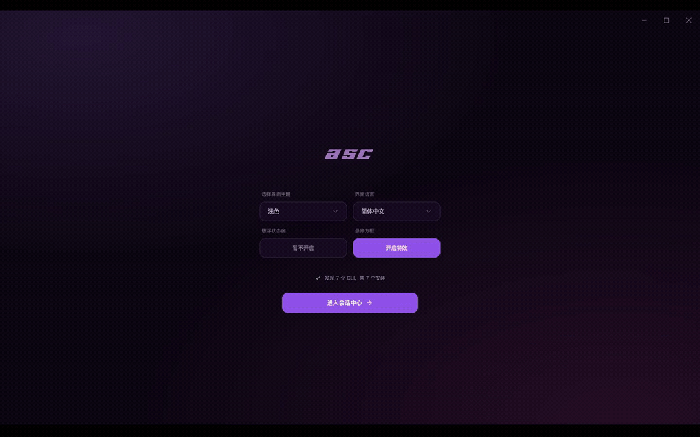

<p align="right">
  <a href="./README.md">English</a>
</p>

<div align="center">
  <picture>
    <source media="(prefers-color-scheme: dark)" srcset="./assets/readme/asc-wordmark-dark.png">
    
  </picture>

  <h3>一个中心管 8 个 Coding Agent</h3>
  <p>查找、恢复、分叉、接力每场会话——审批直接推到手机上。</p>

  <p>
    <a href="./LICENSE"></a>
    <a href="https://github.com/fatedawn/agent-session-center/releases"></a>
    <a href="https://github.com/fatedawn/agent-session-center/releases"></a>
    <a href="https://github.com/fatedawn/agent-session-center/stargazers"></a>
    <a href="https://github.com/fatedawn/agent-session-center/commits/main"></a>
  </p>

  
  <p><sub>会话历史 → AI 查找 → 一键恢复 → 用量与费用 → 飞书审批。 <a href="./docs/demo/asc-demo-zh.mp4">看完整 46 秒视频</a>。</sub></p>
</div>

**Agent Session Center（ASC）** 是一个面向 **8 个 AI Coding Agent** 的桌面会话中心——Claude Code、Codex CLI、OpenCode、Grok Build、Kimi Code、Pi、Antigravity 和 WorkBuddy。浏览并搜索每个 CLI 写到磁盘的会话，一键恢复；当 Agent 停在审批上时，飞书推送把它送到你的手机上——点一下就放行。

干活的原生 TUI 一点不动，ASC 补上的正是外围缺失的那一层：实时状态、注意力提醒、悬浮监控、快速启动和只读工作区浏览。Python 会话工具和飞书助手是同一套产品，在 [`hub/`](./hub)。

## 上游

早期原型源自 [UniRound-Tec/hrack](https://github.com/UniRound-Tec/hrack)（Apache-2.0），该项目与本项目无隶属关系。Agent Session Center 是一个独立维护的硬分叉（hard fork）——拥有自己的身份、路线图和发布渠道，不跟随上游的代码、分支或 Release。本仓库内的全部文件均由本项目维护。署名、改动摘要与继承范围的实测数据见 [NOTICE](./NOTICE)。

上游不发布任何已签名的构建；本项目也不会用本项目的证书去签上游的二进制，更不会以上游名义或本项目名义再分发上游二进制。

## 解决什么问题？

不同 Coding Agent 各有所长，所以一个终端很快就会变成好几个。真正麻烦的不是把它们启动起来，而是一直看着它们：

- 切去做别的事，过一会儿回来，才发现 Agent 一直停在权限确认上白等。Codex 和 Gemini CLI 的用户都提出过类似的提醒需求（[Codex](https://github.com/openai/codex/issues/10081)、[Gemini CLI](https://github.com/google-gemini/gemini-cli/issues/14696)）。
- 同时跑几个 Agent 以后，人又开始在终端标签页之间来回找：“到底哪个在等我？”类似问题也出现在 [HN 的多 Agent 工作流讨论](https://news.ycombinator.com/item?id=47268777) 和 [tmux-claude-session-manager](https://github.com/craftzdog/tmux-claude-session-manager) 这类工具里。
- 有通知也不一定管用：它可能根本没触发（[Codex #8929](https://github.com/openai/codex/issues/8929)），不知道 Agent 正在等回答（[Codex #13478](https://github.com/openai/codex/issues/13478)），或者漏掉交互式 Shell 的输入等待（[Gemini CLI #19527](https://github.com/google-gemini/gemini-cli/issues/19527)）。

Agent Session Center 想解决的就是这些每天都会碰到的小麻烦：把会话放在一起，告诉你谁需要处理，再把你带回正确的位置。真正干活的仍然是原来的 CLI，Agent Session Center 只是让你不用一直盯着它。

## 怎么解决？

第一次启动时，Agent Session Center 会自动扫描主机和 WSL 中兼容的 CLI；之后直接使用缓存快速启动，也可以随时手动重扫。每个已支持的 Harness 都有自己的 Adapter，把官方 Hooks、SSE、Extension API 或运行时事件收敛成一套统一状态：

```text
正在思考 · 调用工具 · 需要你 · 本轮完成 · 发生错误
```

这些事实会同步到侧边栏、悬浮窗和历史记录，但不会进入终端字符流：

```text
CLI ── PTY ──────────────────────────────> 原生 TUI
 └── Hooks / SSE / Extension 事件 ────> Adapter ──> 状态与提醒

工作区 ── 只读访问 ─────────────────────> 文件树与阅读器
```

即使 Observer 失效，PTY 仍会继续运行。Agent Session Center 只会降级状态显示，不会拖垮 CLI 会话。

## 特性

### 每场会话，一张表

会话历史读取的是每个 CLI 自己写到磁盘上的记录——八个来源全覆盖。浏览、一句话语义搜索、隐藏或移入回收站；底层文件永远不会被碰。

<div align="center">
  
</div>

### 原地恢复

Agent 提供可恢复会话时，ASC 支持一键在原工作目录恢复——哪些能恢复、哪些不能、为什么，如实分开标注。

<div align="center">
  
  
</div>

### 一句话让 AI 帮你找会话

用一句话描述你要找什么——「把飞书审批卡片接起来的那场会话」——ASC 会把命中的会话和它的回答一起给你。助手端点由你自己配置，桌面端直连，不经第三方服务中转。

### Token 与费用，按 Agent 分列

用量从每个 CLI 自己的记录聚合而来。Grok Build 自己记账；其余家的费用在模型已知时按模型价目表估算，模型不在价目表里时宁可空着也不猜。

<div align="center">
  
</div>

### 悬浮窗由你定义

默认悬浮监控本身就是一个内置 Renderer。自定义 Renderer 通过同一套公开接口接收真实会话状态，可以用 HTML、CSS、JavaScript、动画库或 Canvas 构建。设置页内置一份简短 Skill，复制后交给你的 Coding Agent，就能帮你创建并安装自己的悬浮窗。

### 不离开会话也能阅读代码

在终端旁打开只读文件树，查看语法高亮的源码并预览 Markdown，Agent 的原生 TUI 仍然保留在左侧。

### 主题、字体和布局

应用主题与终端主题彼此独立；调整终端字体与字号、切换导航模式、在同一个设置页配置悬浮窗 Renderer。

### 跨运行环境快速启动

从 Home 或快速启动面板打开 Shell 或扫描到的 Coding CLI。Agent Session Center 支持主机安装和兼容的 WSL 发行版。DeepSeek Harness 只在扫描到本机或 WSL 安装后才显示。

## 已支持的 Harness

| Harness | 接入方式 | Agent Session Center 可获得的状态 | 运行环境 |
| --- | --- | --- | --- |
| DeepSeek Harness | 官方 Web 页面 + Runtime Bridge | 已关注会话与生命周期 | 主机、WSL |
| Claude Code | 官方 Hooks | 思考、工具、审批、完成状态 | 主机、WSL |
| Codex CLI | Stable Hooks | 回合、工具、审批、上下文压缩 | 主机、WSL |
| OpenCode | Server + SSE | 会话、思考、工具、问题、权限 | 主机、WSL |
| Pi | Extension API | 思考、回复、工具、回合 | 主机、WSL |
| Kimi Code | 官方 Hooks | 回合、思考、工具、审批 | 主机、WSL |
| Grok Build | 官方 Hooks | 回合、思考、工具、审批 | 主机、WSL |

Agent Session Center 还可以扫描并启动 Devin CLI、Cline、Qwen Code、Amp、Aider、Goose、Kiro CLI、GitHub Copilot CLI 等注册表入口。仅启动接入的 CLI 暂时不会提供同等级别的状态细节；后续会继续抽象 Adapter 接口，让新的 Harness 可以按需加载。

## 会话历史

上表列的是**实时观测**接入。读取历史会话是另一套能力，来源也不一样：

| 来源 | 实时状态 | 会话历史 |
| --- | --- | --- |
| Grok Build、Claude Code、Codex CLI、OpenCode、Kimi Code、Pi | 有 | 有 |
| Antigravity、WorkBuddy | 暂无 | 有 |

八个来源都能读历史会话：浏览、搜索、token 用量，以及在该 Agent 提供可恢复会话时的恢复。这两层是分开的 —— 能读历史，不代表能读到它的运行时事件流。

字段深度因来源而异。标题、时间、轮数、token 用量八个来源都有。费用只在算得出时显示 —— 要么是 Agent 自己记的，要么按模型价目表估算；模型不在价目表里时宁可空着也不猜。逐轮 recap 与代码漂移检测目前只有 Grok Build 支撑，因为它来自 `summary.json`；其他几家的会话文件里根本没记这些数据，无从读起。这是上游数据格式的限制，不是待办事项。

## 安装

> **状态：1.x 早期版本。** 可用于日常使用，但配置项命名与 `hub/` 目录结构仍可能在 1.x 内调整；需要长期稳定请锁定具体版本。

从 [GitHub Releases](https://github.com/fatedawn/agent-session-center/releases/latest) 下载最新版本：

- **Windows x64** —— `AgentSessionCenter-Setup-x.y.z.exe`，引导式 NSIS 安装包，可选安装目录。
- **Linux x64** —— `AgentSessionCenter-x.y.z-linux-x64.AppImage`（免安装：下载后 `chmod +x` 直接运行）或 `AgentSessionCenter-x.y.z-linux-x64.deb`（用 `apt` 安装）。
- macOS Apple Silicon（`AgentSessionCenter-x.y.z-macos-arm64.dmg` / `.zip`）目标已配置，并由其受门禁的发版脚本校验，但该包必须在 macOS 上构建。**目前只发 Windows 与 Linux，均为 x64；尚无 macOS 构建。**

Windows 版目前**尚未签名**，首次启动时系统可能显示安全提醒；Linux 包不需要代码签名。每个版本都会在每个可安装文件旁附上 SHA-256 校验值；这个哈希能证明什么、不能证明什么，见 [验证下载](#验证下载)。

### 第一次启动

1. 启动 Agent Session Center，等待第一次 CLI 扫描完成。
2. 选择普通终端或 Coding CLI。
3. 选择运行环境和工作区。
4. 创建会话。原生 TUI 会显示在主区域，Agent Session Center 负责在外围同步状态。

如果 Codex 提示需要审核 Hooks，请打开 `/hooks`，检查并信任 Agent Session Center 的 Hook 定义。对于 Kimi Code，Agent Session Center 会在当前生效的用户 `config.toml` 中维护一个带版本的托管块，并保留托管块之外的内容。Grok Build 会在 `~/.grok/hooks/`（或 `$GROK_HOME/hooks` / 对应 WSL 家目录）写入专用的 `asc-observer.json`，属于 Grok 始终信任的用户级 Hook。

## 本地开发

桌面程序在仓库根目录（`src/` + `electron/`）。

```bash
git clone https://github.com/fatedawn/agent-session-center.git
cd agent-session-center
npm install
npm run dev
```

常用检查：

```bash
npm run typecheck
npm run build
```

端到端测试不在 GitHub CI 里跑 —— 它需要真实的 DeepSeek Harness 宿主和桌面会话。改到 observer 或终端层时，可以在本地用 `npm run e2e:only` 跑。

Windows、macOS、Linux 安装包需要在对应系统上通过 `npm run release:win`、`npm run release:mac` 和 `npm run release:linux` 构建。DSH e2e 会通过 `npm run ensure:dsh` 安装隔离且不入库的 `dsh-runtime` 夹具，它不会打进发行包。完整的发版门禁见 [docs/RELEASING.md](./docs/RELEASING.md)。

## 参与贡献

欢迎提交 Bug、可复现的边界情况和范围明确的 Pull Request。修改 Observer 时，请补充 fixture 或 Runtime 测试来证明事件顺序和降级行为。大型功能建议先开一个 [Issue](https://github.com/fatedawn/agent-session-center/issues)。

本地环境、分支命名和 commit 规范见 [CONTRIBUTING.md](./CONTRIBUTING.md)。

## 代码签名政策

**Windows 版目前没有代码签名。** 安装包以未签名的形式构建和发布，因此 Windows 首次启动时可能显示安全提醒。这里让下载可核对的东西不是签名，而是公布的 SHA-256，加上「这次构建确实跑在本仓库的 CI 上」这个事实 —— 见 [验证下载](#验证下载)。

如果将来加上了签名，它只说明一件事：**这个文件是由本仓库里的发布流水线、基于本仓库的源码自动构建出来的。** 它不代表发布者身份，也不构成任何担保。

### 计划中的签名

本项目计划通过 [SignPath Foundation](https://signpath.org) 为其 Windows 安装包签名。该证书是签发给 SignPath Foundation 本身、而不是签发给我们项目的，**申请尚未提交**，因此当前没有任何版本带签名。一旦启用，需要满足的条件（团队角色、可签名范围、逐次审批方式）记录在 [`docs/SIGNPATH-APPLICATION.md`](./docs/SIGNPATH-APPLICATION.md)。

### 团队角色

Agent Session Center 目前由一人维护，因此签名政策要求的三个角色会由同一位维护者兼任。若之后有新的维护者加入，本表会同步更新，且签名审批改为双人流程 —— 该版本的提交者不能同时审批该版本的发签请求。

| 角色 | 职责 | 成员 |
| --- | --- | --- |
| Authors（提交者） | 可不经额外评审直接修改本仓库源码 | [`@fatedawn`](https://github.com/fatedawn) |
| Reviewers（评审者） | 评审一切由无提交权限者提出的改动 | [`@fatedawn`](https://github.com/fatedawn) |
| Approvers（审批者） | 将逐次审批每个代码签名请求 | [`@fatedawn`](https://github.com/fatedawn) |

全体成员均已对 GitHub 开启多因素认证（MFA）。目前还没有 SignPath 账号，所以这项要求的另一半尚未生效 —— 启用签名时它才生效。

### 计划中的可签名范围

- 只有由本仓库发布流水线构建出的 Windows NSIS 安装包，且每次都必须经人工**审批**。工作流本身无法自行触发签名。
- macOS 与 Linux 包由各自的脚本构建发布，不在任何签名政策范围内。
- 与该版本配套的 `latest.yml` 更新元数据与 `.blockmap` 不同步签名，由公布的 SHA-256 覆盖。

任何来自上游项目的东西永远不签名。本代码库所源自的上游 [UniRound-Tec/hrack](https://github.com/UniRound-Tec/hrack) 只发布未签名构建，且与本项目无隶属关系；不存在任何源自它的二进制会被我们的证书签名，或以我们的名义再分发。Electron、`node-pty` 等随包分发的库保留其自身签名，或在我们安装包内保持未签名状态。

### 发布构建流程

1. 维护者提交版本号变更，并在 `CHANGELOG.md` 中写入对应的 `## [x.y.z]` 段落，然后推送 `vX.Y.Z` 标签。
2. [发布工作流](./.github/workflows/release-windows.yml)在 GitHub 托管的 Windows Runner 上运行：`npm ci` → `npm run build` → 仓库自带的打包脚本。打包脚本会跑完全部门禁（产物资源断言、更新元数据断言、打包后应用启动测试、图标校验）。
3. 工作流把**未签名**的安装包上传为构建产物。这一步不发布任何东西。
4. 维护者审阅产物，并把它的 SHA-256 与工作流摘要核对一致，然后创建 Release，把安装包、`.sha256`、`latest.yml` 与 blockmap 一并附上。

一切能影响最终发布内容的东西 —— 构建脚本、CI 工作流、打包配置、发布门禁 —— 都在本仓库内，并与应用代码同等对待评审。

### 验证下载

```powershell
# 哈希值必须与发行说明里公布的一致
Get-FileHash .\AgentSessionCenter-Setup-x.y.z.exe -Algorithm SHA256
```

哈希对得上，说明下载完整、且就是维护者发布的那个文件。但它本身不能证明「是谁构建的」—— 那恰恰是代码签名唯一能补上的东西，而我们现在还没有签名：

```powershell
# 签名到位后，这条命令会额外报告 Status: Valid
Get-AuthenticodeSignature .\AgentSessionCenter-Setup-x.y.z.exe | Format-List Status, SignerCertificate
```

### 隐私

Agent Session Center 不会把任何信息传输到用户未指定的其他联网系统。唯一会自动发起的请求是向本仓库自身的 Release 检查更新，可用 `ASC_DISABLE_UPDATES=1` 关闭。应用可能发起的每一个网络请求、触发条件、携带内容与关闭方式，全部列在 [PRIVACY.md](./PRIVACY.md)。

## 友情链接

- [LINUX DO](https://linux.do/)

## 开源协议

Agent Session Center 使用 [Apache License 2.0](./LICENSE) 开源。

---

<div align="center">
  <sub>解放心智，回到真正的氛围编程。</sub>
</div>
